<style>
  .embedded-picture {
    position: relative;
    max-width: 400px;
    max-height: 60%;
    margin: auto;
  }
  .hardware-picture {
    position: relative;
    width: 40%;
    float: right;
    margin-right: 10%;
  }
  .coral-picture {
    position: relative;
    width: 55%;
    float: right;
    margin-right: 5%;
    margin-top: -2em;
  }
  tr:nth-child(even) {
    background-color: #f2f2f2;
    color: black;
  }

  tr:nth-child(odd) {
    background-color: #bbb;
    color: black;
  }

  th {
    background-color: lightblue;
  }
  
  .styled-table {
    border-collapse: collapse;
    margin: 25px 0;
    font-size: 0.8em;
    font-family: sans-serif;
    min-width: 400px;
    box-shadow: 0 0 20px rgba(0, 0, 0, 0.15);
  }
  .styled-table thead tr {
    background-color: #1394d9;
    color: #ffffff;
    text-align: left;
    font-weight: bold;
    font-size: 1.1em
  }
  .styled-table th,
  .styled-table td {
    padding: 6px 15px !important;
  }
  .styled-table tbody tr {
    border-bottom: 1px solid #dddddd;
  }
  .styled-table tbody tr:nth-of-type(even) {
    background-color: #f3f3f3;
  }
  .styled-table tbody tr:last-of-type {
    border-bottom: 2px solid #1394d9;
  }
  .styled-table tbody tr.active-row {
    font-weight: bold;
    color: #1394d9;
  }
  td:first-child {
    font-weight: bold
  }
</style>

# IoT? Embedded
<br />
Unter dem Stichwort Embedded werden meistens Geräte verstanden die für spezielle Anwendungen designed werden, jedoch mindestens eine APU (Application Processing Unit) oder MCU (Micro-Controller) genannt haben und angeschlossene Geräte wie etwa Sensoren steuern. <br /> 
<br /> 
Durch die Makerscene und Projekten wie Arduino oder RaspberryPi ist das Entwickeln von Embedded Anwendungen heute nicht mehr nur möglich für Ingenieur_Innen oder Informatiker_Innen, sondern gibt es viele Möglichkeiten für Hobby Projekte einen Einstieg in das Thema zu finden. 
---
hideInToc: true
---

# Roboter  


Hier spielen eine vielzahl von Sensoren mit der Steuerung der Motoren des Roboters zusammen. <br /> Machine Learning oder Deep Learning kommen zum Einsatz um den Steuerungsprozess zu vereinfachen. <br /> Aber Vorsicht, das Entwickeln solcher Ansätze ist sehr aufwändig.

---
hideInToc: true
---

# Autos


<br>
Embedded Systeme existieren etwa in der Motorsteuerung, Assistenz-Systemen oder Infotainment.

---
hideInToc: true
---

# Haushaltsgeräten

<br>

"smarten" Öfen, Kühlschränken und Küchenmaschinen...

---
hideInToc: true
---

# Öffentliche Infrastruktur


<div class = "text-center" style="font-size:12px"> © SWO Netz GmbH / M.K </div>

bei Parkplatzüberwachung, Ampelsteuerung, Umspannwerken, oder Durchflussüberwachung für Wasser oder Gasleitungen.

---
hideInToc: true
---

# BBC micro:bit v2

<br />
Gerade für Menschen die etwas Erfahrung mit Python (aber auch in anderen Sprachen wie Rust oder C) gesammelt haben und sich in der Embedded Entwicklung versuchen wollen, ist der micro:bit ein sehr guter Einstieg.


<br>
<br>

* Viele Beispiele
* Nützliche Sensoren und Geräte an Board
* Günstig (~20 €)
* Einfach zu nutzendes Programmier Interface
* Gute Dokumentation

---
hideInToc: true
---

## Specs BBC micro:bit v2

<table class="styled-table">
    <thead>
        <tr>
            <th>Type</th>
            <th>Component</th>
            <th>Comment</th>
        </tr>
    </thead>
    <tbody>
        <tr>
            <td>MPU</td>
            <td>Nordic nRF52833</td>
            <td>Arm Cortex-M4</td>
        </tr>
        <tr>
            <td></td>
            <td>on-chip</td>
            <td>2.4 GHz transceiver</td>
        </tr>
        <tr>
            <td></td>
            <td>Nordic S140</td>
            <td>Bluetooth 5.1 with BLE</td>
        </tr>
        <tr>
            <td></td>
            <td>on-board & chip</td>
            <td>12bit ADC</td>
        </tr>
        <tr>
            <td></td>
            <td>on-chip</td>
            <td>Temperature sensor</td>
        </tr>
        <tr>
            <td>Audio</td>
            <td>MLT-8530</td>
            <td>Speaker</td>
        </tr>
        <tr>
            <td></td>
            <td>SPU0410LR5H-QB-7</td>
            <td>Microphone</td>
        </tr>
        <tr>
            <td>Motion Sensor</td>
            <td>LSM303AGR</td>
            <td>3x3 Motion Sensor</td>
        </tr>
        <tr>
            <td>on-board</td>
            <td></td>
            <td>LEDs</td>
        </tr>
    </tbody>
</table>

---
hideInToc: true
---

# Raspberry Pi Pico

<br />
Kleiner, sparsamer Microcontroller. Vielfältig da viele IO Aus- und Eingänge.


<br>
<br>

* Günstig (~5 €)
* Einfach zu nutzendes Programmier Interface
* Micropython
* Gute Dokumentation

---
hideInToc: true
---

## Raspberry Pi Pico

<table class="styled-table">
    <thead>
        <tr>
            <th>Type</th>
            <th>Component</th>
            <th>Comment</th>
        </tr>
    </thead>
    <tbody>
        <tr>
            <td>MPU</td>
            <td>RP2040</td>
            <td>Arm Cortex-M0+</td>
        </tr>
        <tr>
            <td></td>
            <td>on-chip</td>
            <td>2.4 GHz 802.11 wireless LAN und BT 5.2 (Pico W und WH)</td>
        </tr>
        <tr>
            <td></td>
            <td>on-board & chip</td>
            <td>12bit ADC mit niedriger Rate</td>
        </tr>
        <tr>
            <td></td>
            <td>on-chip</td>
            <td>Temperature sensor</td>
        </tr>
        <tr>
            <td>on-board</td>
            <td></td>
            <td>LEDs</td>
        </tr>
    </tbody>
</table>

---
hideInToc: true
---
# Raspberry PI 4 Model B
Vergleichbar mit Homecomputer, mit GPU und Betriebssystem.

Vergleichbar mit Homecomputer, mit GPU und Betriebssystem.

<br>
<br>


* Schnelle CPU
* ~ 45-100 €
* Linux / Windows
  * Full Python support
* Graphics Card in SoM
* 64 bit

---
hideInToc: true
---

## Specs Raspberry PI 4 Model B
<table class="styled-table">
    <thead>
        <tr>
            <th>Type</th>
            <th>Component</th>
            <th>Comment</th>
        </tr>
    </thead>
    <tbody>
        <tr>
            <td>MPU</td>
            <td>Broadcom BCM2711</td>
            <td>quad-Core ARM Cortex-A72</td>
        </tr>
        <tr>
            <td></td>
            <td>on-chip</td>
            <td>Broadcom VideoCore IV</td>
        </tr>
        <tr>
            <td></td>
            <td>on-chip</td>
            <td>Video codec acceleration</td>
        </tr>
        <tr>
            <td></td>
            <td>on-board & chip</td>
            <td>Gigabit-Ethernet</td>
        </tr>
        <tr>
            <td></td>
            <td>on-board</td>
            <td>2x micro hdmi</td>
        </tr>
        <tr>
            <td>on-board</td>
            <td></td>
            <td>Dsi display and camera connection
            </td>
        </tr>
        <tr>
            <td>on-board</td>
            <td></td>
            <td>40-pin digital IO</td>
        </tr>
        <tr>
            <td>on-board</td>
            <td></td>
            <td>LEDs</td>
        </tr>
    </tbody>
</table>

---
hideInToc: true
---

# Coral Dev Board Micro

Auf Machine Learning spezialisiertes Board. Später mehr dazu.

<br>


<br>
<br>

* Neu am Markt
* ~100€
* FreeRTOS
* TPU

---
hideInToc: true
---

## Specs Coral Dev Board Micro

<table class="styled-table">
    <thead>
        <tr>
            <th>Type</th>
            <th>Component</th>
            <th>Comment</th>
        </tr>
    </thead>
    <tbody>
        <tr>
            <td>MPU</td>
            <td>NXP i.MX RT1176</td>
            <td>Cortex M7 and M4</td>
        </tr>
        <tr>
            <td></td>
            <td>on-chip</td>
            <td>2D Acceleration</td>
        </tr>
        <tr>
            <td></td>
            <td>on-chip</td>
            <td>Video codec acceleration</td>
        </tr>
        <tr>
            <td></td>
            <td>on-board</td>
            <td>2 x 12 IO Ports for PWM, UART, I2C, ADC, DAC, ...</td>
        </tr>
        <tr>
            <td>on-board</td>
            <td>DF40C-100DP-0.4V</td>
            <td>2x 100 pin Board to Board</td>
        </tr>
        <tr>
            <td>TPU</td>
            <td>Coral Edge TPU coprocessor</td>
            <td>High performance inferencing for Edge TPU runtime
            </td>
        </tr>
        <tr>
            <td>Camera</td>
            <td>HM01B0 CMOS sensor</td>
            <td>324 x 324 on board Camera</td>
        </tr>
        <tr>
            <td>Microphone</td>
            <td>on-board</td>
            <td>PDM Mono Microphone</td>
        </tr>
    </tbody>
</table>

---
hideInToc: true
---

# Embedded python

```mermaid
flowchart TD
    A[Operation System]
    A -- Yes --> B[Use OS to access devices]
    A -- NO --> C[Micropython]
    B --> D["😵‍💫"direkt IO can get tricky]
    C --> E["🤔" MPU supported]
    E -- Yes --> F["🎉" Nice]
    E -- NO --> G["🛠️"use Rust or C/C++]
```

<div class = "text-center">

</div>

---
hideInToc: true
---

## Getting Started🚀

1. Connect your Device
    * micro:bit v2 mit <b>USB-C - JTAG/SWD</b> ueber CMSIS-DAP
    * Raspberry PI 4 <b>SSH</b> oder Serial Connection.
        * ohne OS > USB to TTL Serial Cable
    * Coral micro Usb-c Serial mit FreeRTOS
        * MCUXpresso f&uuml;r bare metal
<br/>
<br />
### micro:bit v2 
- Visual Studio Code extension


---

## Micro Python


Toolset providing a python API to sepcific Boards like:

* STM32 Board family
* BBC micro:bit
* pyboard
* ESP8266
* ESP32
* NXP i.MXRT 10xx
* WiPy/CC3200
* SAMD21/SAMD51

---
hideInToc: true
---

### BBC micro:bit v2 Example

<b>Web based Micro Python</b> [https://python.microbit.org](https://python.microbit.org/v/3)

```python
from microbit import *

while True:
    if button_a.is_pressed():
        display.show(Image.HAPPY)
    elif button_b.is_pressed():
        break
    else:
        display.show(Image.SAD)

display.clear()
```

---

# Machine Learning und Edge TPU
<br />
Spezialisiert auf <b>deep feed-forward</b> neuronale Netzwerke wie etwa CNN's die 8-bit quantifiziert sind. Das heißt die regulären 32bit Gleitkomma-Parameter müssen in 8-bit Representationen konvertiert werden. 
<br />
<br />

## TPU
Auf TensorFlow spezialisierter Beschleuniger-Microcontroller.


---
hideInToc: true
---

## Tensor?
<br />

> Multilineare Abbildung von Vektoren auf einen Vektor mit der universellen Eigenschaft: 
> Ein elementarer Tensor (oder einfacher Tensor) bildet auf einen Zahlenwert (Skalar) ab

<br />
```python
>>> import tensorflow as tf
>>> tf.constant(42)
<tf.Tensor: shape=(), dtype=int32, numpy=42>

>>> t = tf.constant([[1., 2., 3.], [4., 5., 6.]])
<tf.Tensor: shape=(2, 3), dtype=float32, numpy=
array([[1., 2., 3.],
       [4., 5., 6.]], dtype=float32)>
>>> t.shape
TensorShape([2, 3])
>>> t.dtype
tf.float32
```

---
hideInToc: true
---

## Hands on

1. Linear Regression

$\hat{y} = p_0 + p_1 x_1 + p_2 x_2 + \dotsc + p_n x_n$

$\vec{p} = (X^T X)^{-1} X^T \vec{y}$ 

[Example](../src/ml_linreg/main.py)

2. Logistische Regression

$y =\begin{cases}
1 & type\,a\\
0 & not\,a
\end{cases}$

$\hat{p}(X) = \frac{e^{\beta_0+\beta_1X}}{1+e^{\beta_0+\beta_1X}}$ 

[Example](../src/ml_logreg/main.py)

---
hideInToc: true
---

# Hands On

3. Classification

Wie viel Labrador ist ein Saluki?
<div style="columns:2">
    <div>
        <span style="top: 40%; left: 35%; position:absolute; width:30%; height:150px; z-index:10"><a data-flickr-embed="true" data-footer="true" href="https://www.flickr.com/photos/126293865@N04/14953538130" title="Neurons"></a>&nbsp;</span>
        
    </div>
    <div>
        
    </div>
 </div>
---

## Keras
<div style="columns: 2">


Eine Open Source Python Bibliothek die Schnittstellen f&uuml;r Neuronale Netze bietet. Keras bietet h&auml;ufig verwendete Bausteine f&uuml;r Neuronale Netze wie:
- Schichten (layers)
- Verlust oder Kosten Funktionen (objectives)
- Aktivierungs Funktionen (activation functions)
- Optimierer (optimizer)
</div>
```python
from tensorflow.keras import layers
model = keras.Sequential([
        keras.Input(shape=input_shape),
        layers.Conv2D(32, kernel_size=(3, 3), activation="relu"),
        layers.MaxPooling2D(pool_size=(2, 2)),
        layers.Conv2D(64, kernel_size=(3, 3), activation="relu"),
        layers.MaxPooling2D(pool_size=(2, 2)),
        layers.Flatten(),
        layers.Dropout(0.5),
        layers.Dense(num_classes, activation="softmax")])

```
---
hideInToc: true
---

## Convolutional Neural Networks (CNN)


<br />

- Feed forward neural network
- Eigenschafts-Extraktion (Feature engineering)
- Filter

---
hideInToc: true
---

## Model requirements Coral TPU

* 8-bit festpunkt quantisierte Tensor parameter

* Kompilier-Konstante Tensor größe
* Modell parameter Kompilier-Zeit konstant
* 1-,2-, oder 3- Dimensionale Tensoren
* Edge TPU unterstütze Tensor Operationen

---
hideInToc: true
---

## Workflow


---
hideInToc: true
---

<style>
  .code-example {
    border-bottom-width: 0 !important;
    position: absolute;
    top: 50%;
    left: 50%;
    transform: translate(-50%, -50%);
    text-align: center;
    font-size: 60px;
    display: flex;
    flex-direction: row;
  }

  .code-example:hover .code-left {
    animation-name: left;
    animation-duration: 500ms;
  }

  .code-example:hover .code-center {
    animation-name: center;
    animation-duration: 500ms;
  }

  .code-example:hover .code-right {
    animation-name: right;
    animation-duration: 500ms;
  }

  @keyframes left {
    0% {transform: translateX(0)}
    75% {transform: translateX(-20px)}
    100% {transform: translateX(0)}
  }

  @keyframes right {
    0% {transform: translateX(0)}
    75% {transform: translateX(20px)}
    100% {transform: translateX(0)}
  }

  @keyframes center {
    0% {transform: scale(1)}
    75% {transform: scale(1.5)}
    100% {transform: scale(1)}
  }

</style>

# Hands on

<a class="code-example" target="_blank">
  <p class="code-left" >&#60;</p>
  <p class="code-center" >/</p>
  <p class="code-right" >&#62;</p>
  <br/>
</a>

---


# Referenzen und N&uuml;tzliches

<div style="columns:2">

## Workshop Unterlagen
- [ROSEN Konferenzbeitr&auml;ge](https://github.com/rosen-group/conferences)
- [Code Beispiele](https://github.com/afey89/python_workshop_2023/tree/main/src)

## Online 
<svg xmlns="http://www.w3.org/2000/svg" width="22.67" height="12" viewBox="0 0 640 480"><path fill="#012169" d="M0 0h640v480H0z"/><path fill="#FFF" d="m75 0l244 181L562 0h78v62L400 241l240 178v61h-80L320 301L81 480H0v-60l239-178L0 64V0h75z"/><path fill="#C8102E" d="m424 281l216 159v40L369 281h55zm-184 20l6 35L54 480H0l240-179zM640 0v3L391 191l2-44L590 0h50zM0 0l239 176h-60L0 42V0z"/><path fill="#FFF" d="M241 0v480h160V0H241zM0 160v160h640V160H0z"/><path fill="#C8102E" d="M0 193v96h640v-96H0zM273 0v480h96V0h-96z"/></svg>

<b>Kurz Anleitungen</b>
- [Python tutorial](https://docs.python.org/3/tutorial/index.html)
- [Pygame tutorial](https://coderslegacy.com/python/python-pygame-tutorial/)
- [Numpy Schnellstart](https://numpy.org/doc/stable/user/quickstart.html)
- [sklearn Einstieg](https://scikit-learn.org/stable/tutorial/basic/tutorial.html)
- [Keras von Grund auf](https://keras.io/guides/writing_a_training_loop_from_scratch/)
- [Python online](https://www.online-python.com/)
- [Jupyter ausprobieren](https://jupyter.org/try-jupyter/lab/?path=notebooks%2FIntro.ipynb)
- [micro:bit Editor](https://python.microbit.org/v/3)
- [coral micro Schnellstart](https://coral.ai/docs/dev-board-micro/get-started/)

<b>Literatur</b>
- [Einf&uuml;hrung in statistisches Lernen](https://hastie.su.domains/ISLR2/ISLRv2_corrected_June_2023.pdf)

<b> Kurs</b>
- [Umfangreicher ML Kurs von Andrew Ng](https://homl.info/ngcourse)

## Offline
<svg xmlns="http://www.w3.org/2000/svg" width="22.67" height="12" viewBox="0 0 640 480"><path fill="#ffce00" d="M0 320h640v160H0z"/><path d="M0 0h640v160H0z"/><path fill="#d00" d="M0 160h640v160H0z"/></svg>

- [Praxiseinstieg Machine Learning - Aurélien Géron](https://oreilly.de/produkt/praxiseinstieg-machine-learning-mit-scikit-learn-keras-und-tensorflow/)

</div>

<PageNr/>

---

